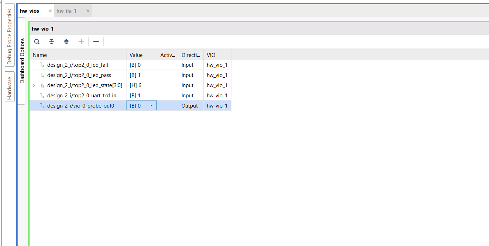

# 32KB RAM on FPGA: From Simulation to System-Level Verification

> A complete journey of verifying a **32KB RAM system** across three levels:  
> **Simulation → On-chip Self-Test → External Interface Validation**

---
## Motivation

Memory seems simple… until you actually verify it.

> Did every byte really get written correctly?  
> Did it come back exactly the same?

---


## Overview

This project implements a **32KB RAM (32768 × 8-bit)** and verifies it using three progressively advanced approaches:

1. **Testbench + Python Verification (Simulation)**
2. **LFSR-Based Self-Checking (FPGA)**
3. **UART-Based System Validation (FPGA + Host)**

---
# Architecture Variants

# 1. Simulation-Based Verification (Testbench + Python)

### Flow

1. Load input data from `write_data.txt`  
2. Write all 32KB into RAM  
3. Read back data into `read.txt`  
4. Compare using Python script (`compare_files.py`)  

---

### Outputs

#### TCL Console


---

#### Write Data


---

#### Read Data


---

#### Comparison Result


---

### Result

- PASS → All bytes matched  
- FAIL → Mismatch detected  

---

#  2. LFSR-Based Self-Checking (FPGA)

### Concept

- Uses **16-bit LFSR** to generate pseudo-random data  
- Writes to:
  - RAM (DUT)  
  - Shadow memory (reference)  

---

###  Flow

1. Generate data internally  
2. Write into RAM + shadow memory  
3. Read back data  
4. Compare internally  

---

### Output

- PASS → LED ON  
- FAIL → LED BLINK  

---

### 📊 Hardware Results

#### Setup


---

#### PASS LED


---

#### VIO Output


---

# 🔌 3. UART-Based System-Level Verification


> A complete FPGA-based memory verification system implementing **receive → store → verify → return → report** using UART communication.

---

## Overview

This project builds a **full end-to-end RAM validation pipeline on FPGA**:

- PC sends **32,768 bytes** over UART  
- FPGA stores data in **Block RAM (BRAM)**  
- Data is read back and **compared internally**  
- Results are:
  - Streamed back to PC  
  - Displayed via **LED status (PASS/FAIL)**  

Combines:
- RTL design  
- On-chip verification  
- External interface validation  

---

## Target Platform

- **FPGA:** Xilinx Artix-7 XC7A50T (Arty A7)  
- **Clock:** 100 MHz  
- **Interface:** UART (115200 baud, 8N1)  
- **Memory:** 32 KB (32768 × 8-bit)  

---

## System Concept

Unlike typical designs that stop at simulation, this system performs:

> **Real hardware validation using actual data transfer**

The FPGA acts as a **self-checking system**, not just a passive memory.

---

## Why Python is Needed

The FPGA cannot:
- read files  
- display output  
- interact with users  

So the Python script acts as the **external operator**.

Flow:

```
write_data.txt
      │
      ▼
uart_host.py
      │
      ▼
FT2232H (USB ↔ UART bridge)
      │
      ▼
FPGA (RTL logic)
      │
      ▼
read.txt + PASS/FAIL
```

---

##  Hardware Architecture

```
PC ──USB──► FT2232H ──► uart_rx ──► RAM + Controller ──► uart_tx ──USB──► PC

                          │
                          ▼
                   Shadow Memory
                          │
                          ▼
                   Compare Logic

Outputs:
- LED_PASS  → success
- LED_FAIL  → error
- LED_STATE → FSM debug
```

---

##  Core Modules

###  `uart_rx.v`

- Converts serial UART → parallel bytes  
- Uses:
  - Mid-bit sampling  
  - Double-flop synchronisation  
- Outputs:
  - `rx_data`
  - `rx_valid`

---

###  `uart_tx.v`

- Converts bytes → serial stream  
- Handles:
  - Start bit  
  - Data bits (LSB first)  
  - Stop bit  

---

###  `ram_controller.v`

Main FSM controlling entire system.

Phases:

| Phase | Function |
|------|--------|
| RECEIVE | Accept UART data and write to RAM |
| WRITE | Store data in RAM + shadow memory |
| READ | Fetch data from RAM |
| COMPARE | Compare with shadow memory |
| SEND | Transmit data back |
| RESULT | Send PASS/FAIL |
| DONE | Drive LEDs |

---

### Shadow Memory

Stores **exact copy of received data**

Eliminates:
- timing mismatch issues  
- LFSR drift  
- regeneration errors  

---

##  Full Data Flow

### Phase 1 — Receive + Write

- UART receives byte  
- Write to:
  - RAM  
  - Shadow memory  

---

### Phase 2 — Read + Compare

- Read RAM + shadow  
- Apply **2-cycle wait for BRAM latency**  
- Compare byte-by-byte  

---

### Phase 3 — Send

- Send all data back to PC  
- Send final result:
  - `'P'` → PASS  
  - `'F'` → FAIL  

---

### Phase 4 — Final State

- LED indicates result  
- System halts  

---

## LED Status

| LED | Meaning |
|----|--------|
| LD0 | PASS (solid ON) |
| LD1 | FAIL (blinking) |
| LD2–LD5 | FSM state |

---
### Output


## Timing Summary

| Operation | Time |
|----------|------|
| Receive | ~2.85 s |
| Read + Compare | ~0.49 ms |
| Send | ~2.85 s |
| **Total** | ~5.7 s |

> UART is the bottleneck — BRAM is ~6000× faster

---


##  Key Design Insights

- **BRAM latency must be handled explicitly**  
- **Shadow memory ensures perfect reference data**  
- **UART introduces real-world system constraints**  
- **Hardware must verify itself, not depend on software**  

---

### UART Verification Output


---
##  Key Insight

> The FPGA performs **primary verification (on-chip)** using comparison logic,  
> while Python provides **secondary verification (host-side)**.

---

# Key Concepts Used

- Memory Design (BRAM behavior)  
- FSM-based control  
- LFSR data generation  
- Shadow memory (golden reference)  
- UART protocol (8N1)  
- File-based verification  
- Hardware-software co-validation  

---

# Project Structure

```
FPGA/
├── LFSR/
├── UART/

Simulation/
├── Output/

RTL/
TB/

Python/
verification/
```

---

#  How to Run

## Simulation

1. Run testbench in Vivado  
2. Generate `read.txt`  
3. Run:
```
python compare_files.py
```

---

## LFSR (FPGA)

1. Generate bitstream  
2. Program FPGA  
3. Observe LED / VIO  

---

## UART Mode

1. Program FPGA  
2. Run:
```
python uart_host.py
```
3. Send data  
4. Observe:
   - LED (FPGA result)  
   - Python output  

---

# Why This Project Stands Out

Most projects stop at simulation.

This project:

- Verifies memory in **simulation + FPGA + UART**
- Implements **self-checking hardware (BIST-like)**
- Combines **RTL + hardware + software validation**

> This is not just RTL design — this is **system-level verification**

---

#  Future Improvements

- AXI interface  
- Dual-port RAM  
- Burst transfers  
- CRC-based UART validation  
- Error reporting system  

---

# Author

**Ramiksha Shetty**

---

