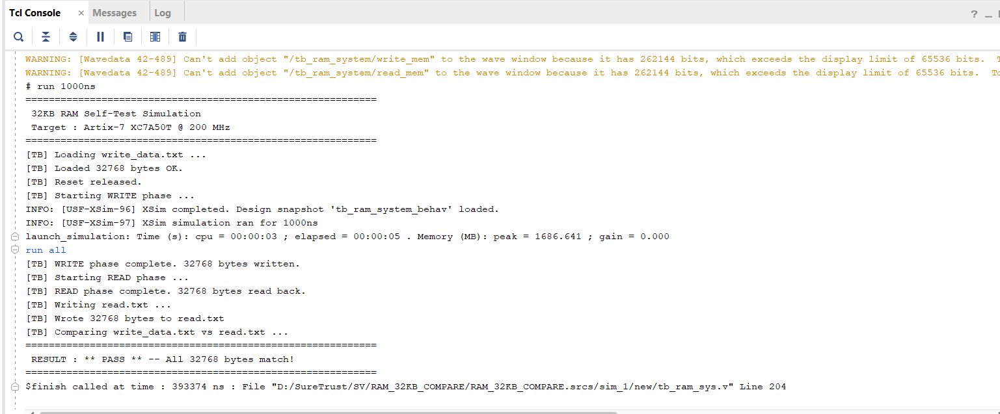
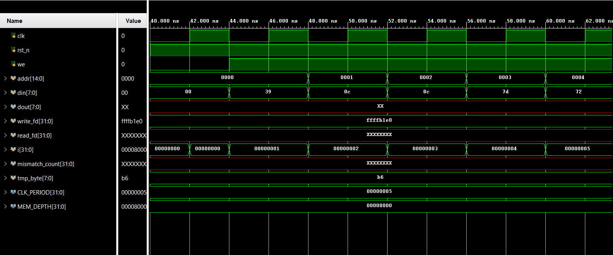
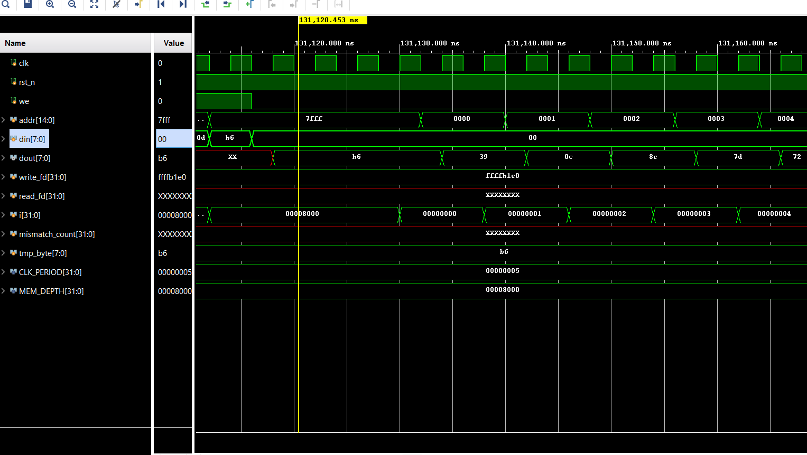
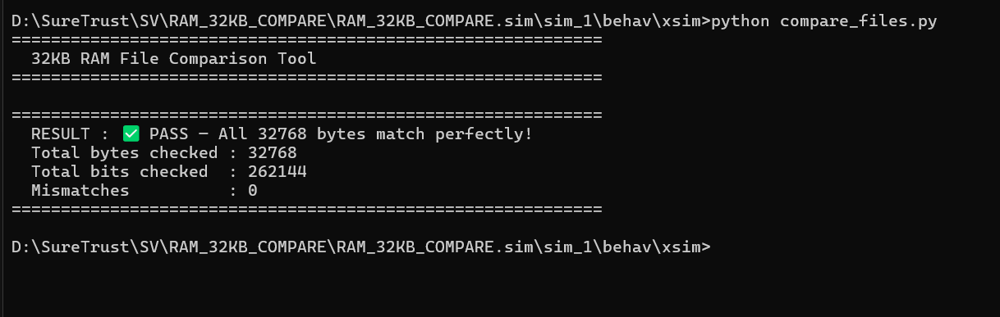
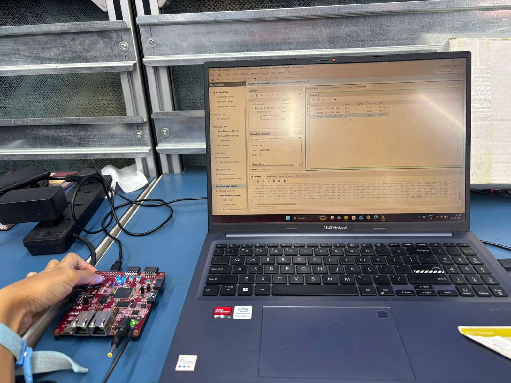
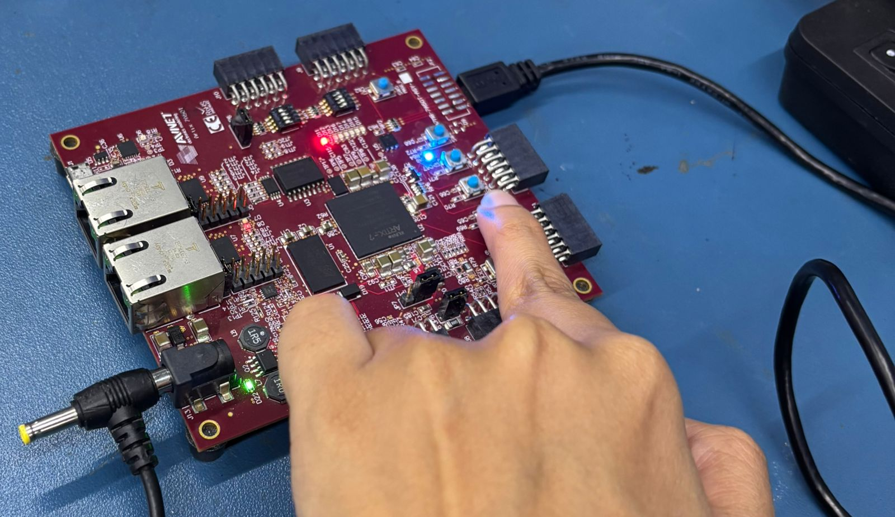
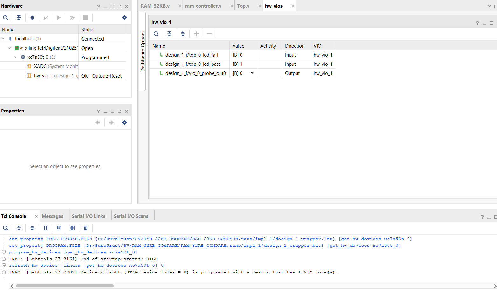
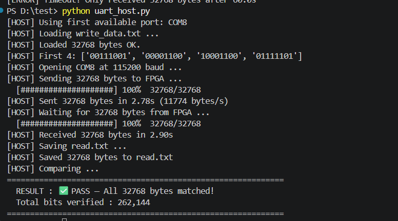

# 32KB RAM on FPGA: From Simulation to System-Level Verification

> A complete journey of verifying a **32KB RAM system** across three levels:  
> **Simulation → On-chip Self-Test → External Interface Validation**

---
## Motivation

Memory seems simple… until you actually verify it.

> Did every byte really get written correctly?  
> Did it come back exactly the same?

---


## Overview

This project implements a **32KB RAM (32768 × 8-bit)** and verifies it using three progressively advanced approaches:

1. **Testbench + Python Verification (Simulation)**
2. **LFSR-Based Self-Checking (FPGA)**
3. **UART-Based System Validation (FPGA + Host)**

---
# Architecture Variants

# 1. Simulation-Based Verification (Testbench + Python)

### Flow

1. Load input data from `write_data.txt`  
2. Write all 32KB into RAM  
3. Read back data into `read.txt`  
4. Compare using Python script (`compare_files.py`)  

---

### Outputs

#### TCL Console



---

#### Write Data



---

#### Read Data



---

#### Comparison Result



---

### Result

- PASS → All bytes matched  
- FAIL → Mismatch detected  

---

#  2. LFSR-Based Self-Checking (FPGA)

### Concept

- Uses **16-bit LFSR** to generate pseudo-random data  
- Writes to:
  - RAM (DUT)  
  - Shadow memory (reference)  

---

###  Flow

1. Generate data internally  
2. Write into RAM + shadow memory  
3. Read back data  
4. Compare internally  

---

### Output

- PASS → LED ON  
- FAIL → LED BLINK  

---

### 📊 Hardware Results

#### Setup



---

#### PASS LED



---

#### VIO Output



---

# 🔌 3. UART-Based System-Level Verification

###  Concept

- External data sent from PC → FPGA  
- FPGA performs **on-chip verification**  
- Python performs **secondary validation**

---

##  Complete Flow

### FPGA Side

1. Receive data via `uart_rx`  
2. Write into RAM  
3. Read back data  
4. Compare internally  

---

### FPGA Output

-  PASS → LED ON (visible on board + VIO)  
-  FAIL → LED BLINK  

---

### Python Host

1. Send `write_data.txt` via UART  
2. Receive data from FPGA  
3. Store as `read.txt`  
4. Compare with original  

---

### UART Verification Output



---

##  Key Insight

> The FPGA performs **primary verification (on-chip)** using comparison logic,  
> while Python provides **secondary verification (host-side)**.

---

# Key Concepts Used

- Memory Design (BRAM behavior)  
- FSM-based control  
- LFSR data generation  
- Shadow memory (golden reference)  
- UART protocol (8N1)  
- File-based verification  
- Hardware-software co-validation  

---

# Project Structure

```
FPGA/
├── LFSR/
├── UART/

Simulation/
├── Output/

RTL/
TB/

Python/
verification/
```

---

#  How to Run

## Simulation

1. Run testbench in Vivado  
2. Generate `read.txt`  
3. Run:
```
python compare_files.py
```

---

## LFSR (FPGA)

1. Generate bitstream  
2. Program FPGA  
3. Observe LED / VIO  

---

## UART Mode

1. Program FPGA  
2. Run:
```
python uart_host.py
```
3. Send data  
4. Observe:
   - LED (FPGA result)  
   - Python output  

---

# Why This Project Stands Out

Most projects stop at simulation.

This project:

- Verifies memory in **simulation + FPGA + UART**
- Implements **self-checking hardware (BIST-like)**
- Combines **RTL + hardware + software validation**

> This is not just RTL design — this is **system-level verification**

---

#  Future Improvements

- AXI interface  
- Dual-port RAM  
- Burst transfers  
- CRC-based UART validation  
- Error reporting system  

---

# Author

**Ramiksha Shetty**

---

